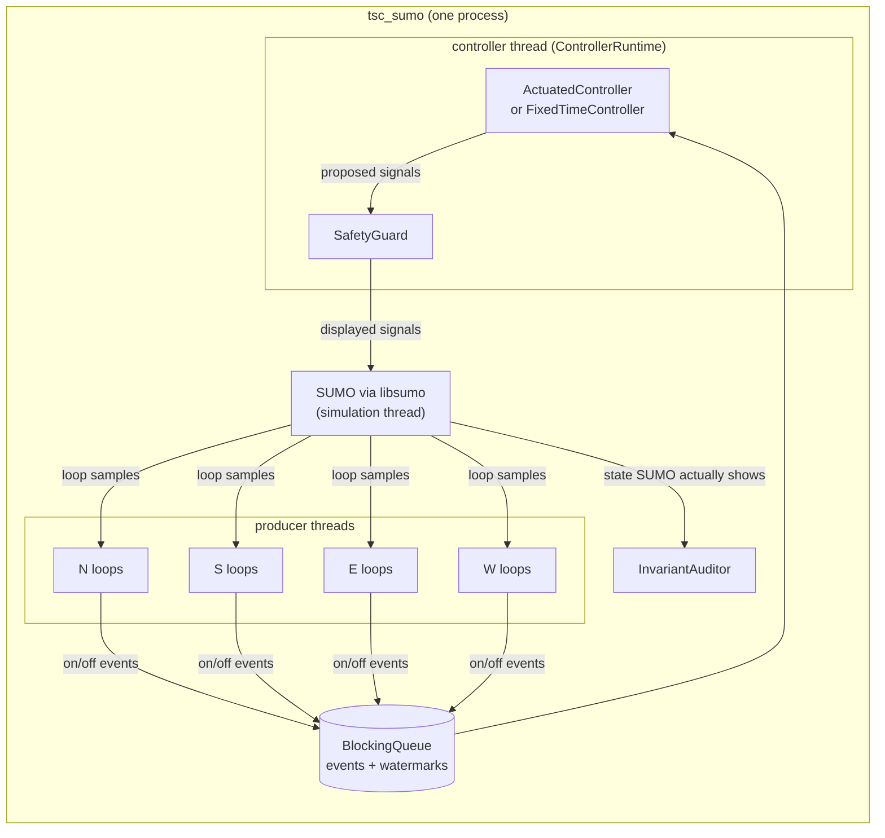

# traffic-signal-controller

An actuated traffic-signal controller for one four-arm junction, written in C++20, with a
separate safety layer, multi-threaded detector ingestion, and a SUMO harness that compares it
with a fixed-time plan and with SUMO's own actuated controller.

This is a personal project (2026). It is a simulation study, not a certified or deployed
controller.

## What it does

* **Actuated control.** Four phases in a fixed ring: north-south through, north-south turn-across
  (protected right turn, left-hand traffic as in Singapore), east-west through, east-west
  turn-across. Each phase has min green, max green, a passage (gap-out) time, yellow and
  all-red. Loop detectors 30 m upstream extend the green; the phase ends by **gap-out** (no
  vehicle for the passage time after min green) or **max-out** (max green reached). The two
  turn-across phases are skipped when nobody calls them; call-only loops at their stop lines
  make sure a waiting vehicle always calls. The through phases are on min recall. A green only
  ends if another phase is waiting (otherwise it rests in green).
* **Safety guard, separate from the control logic.** Every proposed signal vector goes through
  `SafetyGuard` before it is shown. It keeps its own record of what is displayed and refuses
  unsafe commands. On a refusal it latches into fail-safe.
* **Detector faults.** A loop that stays occupied for longer than `stuck_on_s` or empty for
  longer than `stuck_off_s` while other loops see traffic is declared faulty; its events are
  ignored and its phase falls back to recall. Too many faulty loops (more than `max_faulty`) sends the junction to fail-safe.
* **Concurrent detector ingestion.** One producer thread per approach feeds detector events
  through a thread-safe queue to the controller thread. The result does not depend on thread
  scheduling (see [Concurrency](#concurrency)).
* **Config from JSON, validated.** `configs/intersection.json` holds groups, the conflict matrix,
  phases, timings, detectors and fault settings. A bad file is rejected with every problem
  listed, e.g. min green above max green, a non-symmetric conflict matrix, two conflicting
  groups in one phase, a yellow outside 3-6 s, times not on the 0.5 s tick, unknown keys.
* **Fixed-time baseline.** `webster()` computes Webster's optimum cycle and green splits from
  the demand, using saturation flows measured in SUMO for this network.

## Architecture



| Part | File | Role |
|---|---|---|
| Config | `include/tsc/config.hpp`, `src/config.cpp` | JSON parsing and validation |
| Phase machine | `src/sequencer.cpp` | start-up all-red, then green -> yellow -> all-red per phase |
| Actuated logic | `src/actuated.cpp` | calls, extension, gap-out / max-out, skipping, recall, fault fallback |
| Fixed time | `src/fixed_time.cpp`, `src/webster.cpp` | pre-timed plan from Webster's formula |
| Detector faults | `src/detector_monitor.cpp` | stuck-on / stuck-off / lost-feed detection |
| Safety guard | `src/safety_guard.cpp` | checks every command before it is shown; fail-safe |
| Auditor | `src/auditor.cpp` | second, independently written checker of the displayed sequence |
| Threads | `include/tsc/blocking_queue.hpp`, `src/runtime.cpp` | producer threads -> controller thread |
| Tools | `apps/tsc_cli.cpp`, `apps/tsc_sumo.cpp` | `tsc validate / webster / replay`; SUMO harness |
| Experiments | `sim/*.py` | network, calibration, demand, runs, statistics (Python stdlib only) |

**SUMO coupling.** The harness links SUMO in-process through libsumo, the C++ TraCI API that
ships with the Ubuntu `sumo` package (`/usr/include/libsumo`, `libsumocpp.so`), so the C++
controller drives the simulation directly with no Python or socket in the loop.

## Safety design

The controller proposes; the guard decides. The guard (`SafetyGuard::apply`) checks each
proposed vector against the aspects it is currently displaying and how long each has been shown:

1. no two conflicting groups may be non-red at the same time (green or yellow);
2. a green must have lasted its min green before it turns yellow;
3. green may only go to yellow, yellow only to red, red only to green; a yellow must last its
   configured time;
4. a group may turn green only if every conflicting group has been red for at least that
   group's all-red time (at start-up all groups count as red from time 0, so the first green
   waits for the all-red too).

It also refuses a command with the wrong number of groups or a timestamp that does not move
forward. Any refusal latches **fail-safe**: groups showing green get their full yellow, then
everything is held red (all-way stop / flashing red on street hardware). Fail-safe entry is the
one case where a green may end before its min green; the yellow is never skipped. Only a
restart clears it. The controller can also request fail-safe, which it does when more than
`max_faulty` detectors are faulty.

The same rules are implemented a second time, separately, in `InvariantAuditor`, which checks
a stream of displayed states after the fact. The tests use it to check the guard's output, and
the SUMO harness runs it on the signal state SUMO reports every step, for all three controllers
including SUMO's own.

Config validation is the first line: the conflict matrix must be symmetric with an empty
diagonal, groups in one phase must not conflict, every group must be in exactly one phase, the
all-red must be at least one tick, and a phase without recall must have a detector.

## Concurrency

Each producer thread sends detector events and a *watermark* ("everything up to time w has
been sent"). The controller thread runs tick `T` only when every connected producer's
watermark has reached `T`, and applies that tick's events in a fixed order (time, detector,
on-before-off). So the signal sequence is the same however the threads interleave; a test runs
four producers with random pauses five times and compares every tick with a single-threaded
run. A producer that disconnects is treated as a lost feed: its loops are declared faulty.
`libsumo` is not thread-safe, so SUMO is only touched from the simulation thread, which hands
raw samples to the producers.

## Tests and checks

87 GoogleTest tests (`tests/`), all run in every build type:

| Suite | What it pins down |
|---|---|
| `Config` | the repository config loads; each class of bad config is rejected with a specific message; all problems are reported together |
| `Actuated` | start-up all-red; min green; exact gap-out and max-out ticks; yellow then all-red; phase skipping; calls placed during red/yellow but not by vehicles already being served; presence calls; rest in green; max recall; call-only stop-bar loops |
| `FixedTime`, `Webster` | fixed plan timeline and cycle; a textbook Webster case; clamping, over-saturation, min greens; demand-file parsing |
| `GuardAtNsGreen`, `SafetyGuard` | every rule of the guard at its boundary (e.g. green at 16.5 s refused, 17.0 s accepted); fail-safe entry, yellow in fail-safe, latching |
| `Audit` | the independent auditor detects each kind of violation |
| `Faults`, `DetectorMonitor` | stuck-on and stuck-off at exactly the threshold; recall fallback (max and min); starvation when fault handling is off; fail-safe when too many loops fail; lost feeds; a quiet junction is not a fault |
| `Property` | 2,000 random configs x random detector histories (bursts, long occupancies, duplicate edges, loops that stick on or go silent), fixed seed: the guard never refuses a controller command, the auditor finds nothing, and no called phase waits longer than one worst-case cycle. A second property feeds the guard 1,000 x 400 ticks of random commands and checks that what it displays is always safe and that it never blocks a command its own check accepts. |
| `Concurrency`, `BlockingQueue` | four producer threads with random pauses give tick-for-tick the same signals as one thread (5 runs); a disconnecting producer becomes a lost feed; `stop()` unblocks producers stuck on a full queue; the producer contract is enforced; the queue loses nothing under 4 producers x 3 consumers |

Other checks, all in `scripts/ci.sh`:

* `-Wall -Wextra -Wpedantic -Wshadow -Wconversion -Wsign-conversion -Wold-style-cast ... -Werror`
  on this repository's code (not on third-party headers).
* The whole suite under **ASan + UBSan** and under **TSan** (separate CMake presets). TSan
  found one real data race during development: producer threads asking for their handles at
  the same time wrote to a `std::vector<bool>` whose elements share a machine word. It is now
  guarded by a mutex.
* **clang-tidy** with a small check set (`.clang-tidy`: bugprone, concurrency, performance and a
  few others), warnings as errors.
* **Mutation check** (`tests/mutate.py`): 47 deliberate bugs, planted one at a time in the
  safety guard, actuated logic, phase sequencing, fault monitor, threaded runtime, queue,
  config validation, Webster and auditor code. For each one the script rebuilds, checks that
  it compiles, and runs the suite; it first checks that the unmodified code passes. Result:
  47/47 killed. One candidate mutant (weakening the conflict check from "non-red" to "green")
  turned out to be equivalent, because the transition rules already make a yellow next to a
  conflicting green unreachable; it was replaced by one that removes the check, and a test
  was added for two conflicting groups released in the same tick.

## Build and run

Needs Linux (tested on Ubuntu 24.04 under WSL2) with g++ 13 or clang 18, CMake >= 3.25, Ninja,
GoogleTest and nlohmann-json; SUMO 1.18 for the simulations.

```bash
sudo apt-get install g++ clang cmake ninja-build libgtest-dev libgmock-dev nlohmann-json3-dev clang-tidy
sudo apt-get install sumo sumo-tools          # only for the SUMO parts

scripts/ci.sh test        # Debug build with -Werror, all tests
scripts/ci.sh asan        # ASan + UBSan build, all tests
scripts/ci.sh tsan        # TSan build (clang), all tests; may need: sudo sysctl vm.mmap_rnd_bits=28
scripts/ci.sh tidy        # clang-tidy
scripts/ci.sh mutation    # tests/mutate.py
scripts/ci.sh sumo        # Release build + SUMO harness + 15-minute smoke run
```

Build directories go to `./build/<preset>` (set `TSC_BUILD_ROOT` to put them elsewhere). The
GitHub Actions workflow (`.github/workflows/ci.yml`) runs the same six jobs through the same
script.

Command-line tool:

```bash
build/debug/tsc validate configs/intersection.json
build/debug/tsc replay   configs/intersection.json configs/example_events.csv 60
build/debug/tsc webster  configs/intersection.json sim/generated/medium.demand.json
```

Reproducing every number below (SUMO dominates the run time; expect roughly an hour on a few cores):

```bash
cmake --preset release && cmake --build build/release
python3 sim/calibrate.py            # saturation flows -> results/calibration.json
python3 sim/run_experiments.py      # 180 SUMO runs -> results/runs/ (git-ignored)
python3 sim/analyze.py              # -> results/results.json, results/results.md
```

## Evaluation in SUMO

**Setup.** One four-arm junction built with `netconvert --lefthand` (500 m arms, 50 km/h; each
approach has a near-side-turn + through lane, a through lane and a turn-across lane). Loops sit
30 m before the stop line on every approach lane, plus a call-only stop-bar loop on each
turn-across lane. Demand is seeded Poisson arrivals per movement (15 % near-side turn, 70 %
through, 15 % turn-across), generated for 0-3600 s; the simulation runs until the network is
empty (hard stop 7200 s), step 0.5 s. 10 seeds per scenario; every controller sees the same
arrivals and the same SUMO seed, so comparisons are paired.

**Controllers.**
1. *Fixed-time (Webster)*: cycle and splits from `tsc::webster()` using the scenario's flows
   and saturation flows measured in SUMO on this network (`sim/calibrate.py`: 2101 veh/h/lane
   through, 1905 veh/h/lane turn-across; `results/calibration.json`). Cycle limited to 40-150 s.
   It runs through the same C++ pipeline and safety guard as the actuated controller.
2. *Actuated (this repo)*, with `configs/intersection.json`.
3. *SUMO actuated (reference)*: SUMO's built-in `actuated` tlLogic with the same phases, min/max
   greens, clearances and max-gap, and phase skipping through SUMO's `next` attribute
   (`sim/build_network.py` writes it). It uses SUMO's own detectors.

**Measures** (window 300-3600 s): mean delay per vehicle = SUMO `timeLoss` + insertion delay;
p95 queue = 95th percentile over time of the longest approach queue (halting vehicles);
throughput = vehicles completing their trip; gap-outs and max-outs per hour over all phases.
Intervals are 95 % Student-t intervals over the 10 seeds; differences are paired by seed.

### Results

| Scenario (veh/h per approach) | Controller | Mean delay (s/veh) | p95 queue (veh) | Throughput (veh/h) | Gap-outs/h | Max-outs/h |
|---|---|---|---|---|---|---|
| low (300) | Fixed-time (Webster) | 22.5 [22.2, 22.9] | 5.4 [5.0, 5.8] | 1178 [1146, 1209] | - | - |
| | Actuated (this repo) | 18.9 [18.5, 19.4] | 5.0 [5.0, 5.0] | 1178 [1148, 1207] | 251 | 0 |
| | SUMO actuated | 21.7 [21.2, 22.3] | 5.0 [5.0, 5.0] | 1175 [1145, 1206] | 237 | 0 |
| medium (600) | Fixed-time (Webster) | 26.1 [25.7, 26.4] | 9.9 [9.7, 10.1] | 2393 [2367, 2419] | - | - |
| | Actuated (this repo) | 25.5 [24.9, 26.0] | 10.5 [10.1, 10.9] | 2396 [2372, 2420] | 226 | 0 |
| | SUMO actuated | 29.6 [28.9, 30.3] | 11.5 [10.9, 12.1] | 2390 [2368, 2412] | 193 | 4 |
| high (1200) | Fixed-time (Webster) | 53.1 [51.1, 55.0] | 36.7 [33.9, 39.5] | 4768 [4723, 4812] | - | - |
| | Actuated (this repo) | 53.5 [52.1, 54.8] | 38.1 [36.7, 39.5] | 4774 [4732, 4816] | 55 | 49 |
| | SUMO actuated | 61.0 [57.7, 64.3] | 40.5 [37.6, 43.4] | 4768 [4726, 4810] | 40 | 59 |
| asymmetric (1100 N/S, 300 E/W) | Fixed-time (Webster) | 30.2 [29.1, 31.3] | 16.3 [15.5, 17.1] | 2793 [2747, 2839] | - | - |
| | Actuated (this repo) | 26.4 [25.9, 27.0] | 14.1 [13.5, 14.7] | 2794 [2744, 2844] | 181 | 6 |
| | SUMO actuated | 30.3 [29.0, 31.7] | 15.0 [14.2, 15.8] | 2795 [2750, 2841] | 159 | 13 |
| saturated (1600) | Fixed-time (Webster) | 330.4 [313.8, 347.0] | 158.4 [154.6, 162.2] | 5606 [5583, 5630] | - | - |
| | Actuated (this repo) | 395.2 [376.2, 414.2] | 150.2 [148.6, 151.8] | 5388 [5362, 5413] | 6 | 91 |
| | SUMO actuated | 214.7 [199.3, 230.1] | 147.7 [140.6, 154.8] | 5954 [5938, 5970] | 0 | 89 |

Paired difference in mean delay, actuated (this repo) minus the other controller:

| Scenario | vs fixed-time (s/veh) | vs fixed-time (%) | vs SUMO actuated (s/veh) | vs SUMO actuated (%) |
|---|---|---|---|---|
| low | -3.6 [-3.9, -3.3] | -16.0 | -2.8 [-3.3, -2.3] | -12.9 |
| medium | -0.6 [-1.2, -0.1] | -2.4 | -4.1 [-4.8, -3.5] | -14.0 |
| high | +0.4 [-0.9, 1.7] | +0.7 | -7.6 [-10.1, -5.0] | -12.4 |
| asymmetric | -3.8 [-4.5, -3.1] | -12.4 | -3.9 [-4.8, -3.0] | -12.8 |
| saturated | **+64.8 [57.1, 72.5]** | **+19.6** | **+180.5 [169.2, 191.8]** | **+84.1** |

Every run was checked by the auditor on the states SUMO displayed:

| Controller | Runs | Auditor violations | Guard refusals | Runs ending in fail-safe |
|---|---|---|---|---|
| Fixed-time (Webster) | 50 | 0 | 0 | 0 |
| Actuated (this repo) | 130 | 0 | 0 | 0 |
| SUMO actuated | 50 | 0 | n/a | n/a |

(The 130 actuated runs include the fault and ablation runs below. SUMO's programme is started in
its final all-red phase so it gets the same start-up clearance; started at its first green, the
auditor flags that opening green, as it should.)

### Where actuated control does not win

* **Saturated demand (1600 veh/h per approach): it loses clearly**, to both. Delay is 64.8 s/veh
  (19.6 %) worse than the Webster plan and throughput 219 [201, 236] veh/h lower. Once demand
  exceeds what the max greens can serve, every phase maxes out (91 max-outs vs 6 gap-outs per
  hour) and the controller turns into a fixed-time plan whose splits are the configured max
  greens (45/20/45/20 s, a 150 s cycle). Webster uses the same 150 s cycle but splits it by
  demand (47/18/47/18 s), which moves more through traffic. In delay by movement
  (`results/results.md`), the actuated controller gives turn-across traffic 124.8 s/veh against
  240.8 s/veh under Webster, but through traffic 441.0 s/veh against 343.5 s/veh. Max greens are
  a design choice; they were not tuned to the scenarios.
* **High demand (1200 veh/h per approach): no measurable difference** from the Webster plan
  (+0.4 s/veh, interval includes zero). At medium demand the gain is 0.6 s/veh (2.4 %) and the
  p95 queue is slightly longer (+0.6 [0.2, 1.0] veh). The clear gains are at low and asymmetric
  demand, where a fixed plan wastes green on empty phases.
* **SUMO's reference does much better at saturation** (214.7 s/veh) by a different trade-off:
  it skips the turn-across phases more often, so through traffic waits 147.3 s/veh but
  turn-across traffic 586.7 s/veh. At every demand level its turn-across delay is more than
  double this controller's (e.g. 90.4 vs 32.0 s/veh at medium). The SUMO programme is my own
  configuration of SUMO's controller; a different setup of its parameters could behave better.

### Detector fault: stuck-off loops fall back to recall

At 600 s (medium demand) all four loops of the north-south turn-across phase (advance and
stop-bar, N and S) are forced to report "empty", as if their detector card failed. The phase
has no recall, so nothing calls it any more.

| Variant | Mean delay, all vehicles (s/veh) | Mean delay, N->W and S->E turns (s/veh) | Vehicles still in the network at 7200 s | Fault declared at (s) |
|---|---|---|---|---|
| no fault | 25.5 [24.9, 26.0] | 31.5 [30.4, 32.6] | 0 | - |
| fault, fault handling off | 333.2 [325.2, 341.2] | 4801.6 [4634.4, 4968.9] | 1529 (10 runs) | - |
| fault, fault handling on | 38.9 [37.0, 40.8] | 155.6 [131.7, 179.6] | 0 | 1349.5 to 1500 |

North-south turn-across greens started per 300 s (mean of 10 seeds):

| Variant | 0-300 | 300-600 | 600-900 | 900-1200 | 1200-1500 | 1500-1800 | 1800-2100 | 2100-2400 |
|---|---|---|---|---|---|---|---|---|
| no fault | 3.9 | 4.5 | 4.2 | 4.5 | 4.6 | 4.3 | 4.7 | 4.2 |
| handling off | 3.9 | 4.5 | 0.6 | 0.0 | 0.0 | 0.0 | 0.0 | 0.0 |
| handling on | 3.9 | 4.5 | 0.6 | 0.0 | 1.0 | 3.6 | 3.9 | 3.6 |

Without fault handling the phase is never served again and the turning queue blocks the
approach. With it, each loop is declared stuck-off once it has been silent for 900 s while the
other loops kept seeing traffic (between 1349.5 and 1500 s; silence is counted from each loop's
last real vehicle, which can be before 600 s), the phase goes to max recall and is served every
cycle again. The 900 s threshold is the cost: the turning traffic still waits 155.6 s/veh on
average over the hour instead of 31.5.

### Ablation: stop-bar loops that also extend the green

Letting the stop-bar loops extend the green (instead of call-only) costs delay in every
scenario, from 0.8 [0.4, 1.3] s/veh at low demand to 4.2 [3.3, 5.2] s/veh at high demand and
17.2 [10.8, 23.6] s/veh saturated, because a queued vehicle on the stop-bar loop holds the
turn-across green.

### Found by the simulation during development

These were bugs in earlier versions that the tests did not catch and the SUMO runs did:

* **A stranded vehicle.** With only the 30 m loops, a turn-across vehicle that crossed its loop
  while its green was running, then stopped at the stop line on the yellow, had placed no call
  (it was "being served") and was no longer on the loop. When it was the last one, the phase
  was skipped until the run ended. The fix is the call-only stop-bar loop on each turn-across
  lane: a vehicle standing on it keeps calling.
* **A quiet junction treated as a broken one.** After demand ended, every loop went silent for
  900 s, all were declared stuck-off and the junction went to fail-safe. A loop now counts as
  stuck-off only if the other loops saw at least `stuck_off_min_others` vehicles (20) during
  its silence.

Both fixes have unit tests (`Actuated.CallOnlyStopBarLoopCallsButDoesNotExtend`,
`DetectorMonitor.SilenceIsOnlyAFaultWhileOtherLoopsSeeTraffic`) and mutants in `tests/mutate.py`.
All numbers above are from the fixed version.

### How the numbers were produced

`sim/run_experiments.py` builds the network, writes the demand files and routes (seeded), and
runs 230 simulations with `build/release/tsc_sumo`: 5 scenarios x 10 seeds x 3 controllers,
30 fault runs, 50 ablation runs. `sim/analyze.py` reads the per-run records and writes
`results/results.json` and `results/results.md`; every number in this README is copied from
those two files or from `results/calibration.json` (written by `sim/calibrate.py`). Per-run
records (`results/runs/`) and SUMO inputs (`sim/generated/`) are git-ignored and regenerated by
the scripts.

## Limits

* One isolated junction; no coordination along an arterial, no pedestrians, no buses or
  priority, no pre-emption.
* Detectors are simulated SUMO induction loops. Faults are injected in the harness; real loop
  faults (chattering, cross-talk, partial failure) are only covered by the randomised tests.
* Time is simulated and advanced in lock-step with SUMO. The runtime has no wall-clock
  watchdog: a producer that stalls without disconnecting would stall the controller. A real
  controller needs a hardware watchdog and conflict monitor independent of this software.
* The max-green timer runs from the start of green (as in SUMO), not from the first conflicting
  call as in NEMA practice.
* Max greens, passage times and fault thresholds are reasonable values, not tuned per scenario.
  Saturation flows and all results are for SUMO's default car-following model, not field data.
* This is not a certified controller and has not been checked against any traffic-signal
  standard. It is a personal simulation project.
